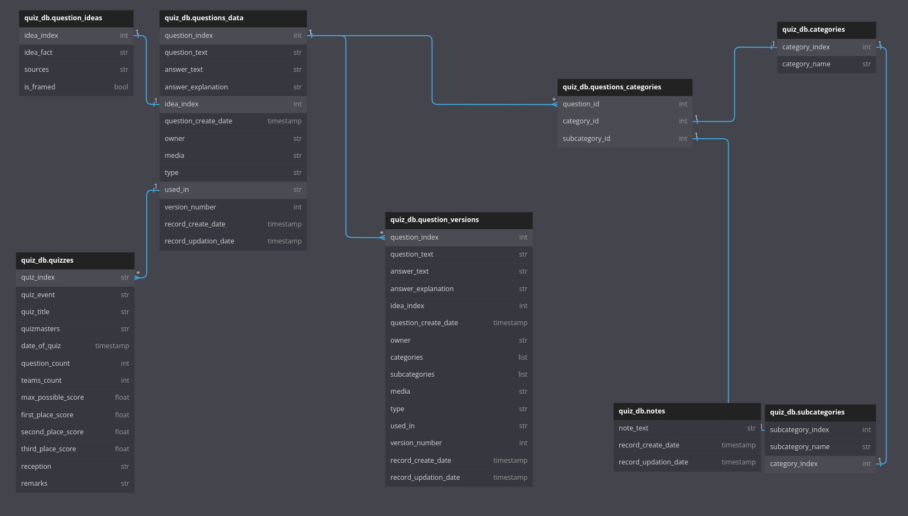

# quiz-quesbank-management

This is a test project to manage the questions that my friend and I write for the quizzes we do. The initial working version is going to be simpler and easier in its scope, it will be aimed only at managing the questions and associate them with the ideas.

## Why Does This Have To Exist?

Everything is basically being shuffled between a Word document and an Excel spreadsheet. There's a need to change that using a website that updates the database but also gives a interface that acts both as the Word document and automatically adds the question to the database. This will make referencing easy as well, with the questions becoming easier to fetch and eliminating the need for Excel and Word.

## Database Details

### List of Tables

The following are the tables in the database:

* ```question_ideas```: a table to store the list of ideas
* ```questions_data```: this contains the list of questions. Probably the most expansive of the lot.
* ```question_versions```: old versions of questions. Ideally this specific data is not very important but it is a nice thing to have just in case. It's not a nice to have, this is to be implemented for sure.
* ```categories```: only categories stored and corresponding unique IDs.
* ```subcategories```: subcategories with unique IDs and associated with a category.
* ```quizzes```: table to store information about the quizzes conducted.
* ```notes```: store different ideas for quizzes that can be referred to later when quizzes are being created or conducted.


### Table Details

Cell information mandatory unless specified otherwise.

#### ```question_ideas```
* ```idea_index```: \[```int```\] unique identifier of idea.
* ```idea_fact```: \[```str```\] the fact or idea for the question.
* ```sources```: \[```str```\]\[```optional```\] resources for the relevant information to frame the question.
* ```is_framed```: \[```bool```\] to determine if a question is already framed or not.

#### ```questions_data```
* ```question_index```: \[```int```\] unique identifier for the question, this has to be tied into a corresponding idea in the ```questions_ideas``` table.
* ```question_text```: \[```str```\] the actual text of the question.
* ```answer_text```: \[```str```\] the actual text of the answer.
* ```answer_explanation```: \[```str```\]\[```optional```\] any explanation to supplement the answer.
* ```idea_index```: \[```int```\]\[```optional```\] the index of the corresponding idea from the ```questions_ideas``` table will populate this column.
* ```question_create_date```: \[```timestamp```\] the timestamp for the creation of the question.
* ```owner```: \[```str```\] the creator/writer of the question.
* ```categories```: \[```list```\] multiple integers dedicated to the category of the question.
* ```subcategories```: \[```list```\] multiple integers dedicated to the subcategory of the question. 
* ```media```: \[```str```\] comma separated filenames of the media used in the question and answer.
* ```type```: \[```str```\] written as a solo or a themed round question.
* ```used_in```: \[```str```\] comma separated list of quiz identifiers that the question was used in.
* ```version_number```: \[```int```\] the incarnation of the question in the table.
* ```record_create_date```: \[```timestamp```\] the date of the creation of the record.
* ```record_updation_date```: \[```timestamp```\] the last updated timestamp of the record.

#### ```question_versions```
* ```question_index```: \[```int```\] unique identifier for the question, this has to be tied into a corresponding question in the ```questions_data``` table.
* ```question_text```: \[```str```\] the actual text of the question.
* ```answer_text```: \[```str```\] the actual text of the answer.
* ```answer_explanation```: \[```str```\]\[```optional```\] any explanation to supplement the answer.
* ```idea_index```: \[```int```\]\[```optional```\] the index of the corresponding idea from the ```questions_ideas``` table will populate this column.
* ```question_create_date```: \[```timestamp```\] the timestamp for the creation of the question.
* ```owner```: \[```str```\] the creator/writer of the question.
* ```categories```: \[```list```\] multiple integers dedicated to the category of the question.
* ```subcategories```: \[```list```\] multiple integers dedicated to the subcategory of the question. 
* ```media```: \[```str```\] comma separated filenames of the media used in the question and answer.
* ```type```: \[```str```\] written as a solo or a themed round question.
* ```used_in```: \[```str```\] comma separated list of quiz identifiers that the question was used in.
* ```version_number```: \[```int```\] the incarnation of the question in the table.
* ```record_create_date```: \[```timestamp```\] the date of the creation of the record.
* ```record_updation_date```: \[```timestamp```\] the last updated timestamp of the record.

#### ```categories```
* ```category_index```: \[```int```\] unique index to identify the category.
* ```category_name```: \[```str```\] name of the category.

#### ```subcategories```
* ```subcategory_index```: \[```int```\] unique index to identify the subcategory.
* ```subcategory_name```: \[```str```\] name of the subcategory.
* ```category_index```: \[```int```\] corresponding category index.

#### ```quizzes```
* ```quiz_index```: \[```str```\] unique identifier for the quiz in question.
* ```quiz_event```: \[```str```\]\[```optional```\] a type for the quiz, if there is any any.
* ```quiz_title```: \[```str```\]\[```optional```\] name of the final quiz.
* ```quizmasters```: \[```str```\] comma separated list of quizmasters.
* ```date_of_quiz```: \[```timestamp```\] the date of the event.
* ```question_count```: \[```int```\] the number of questions in the quiz.
* ```teams_count```: \[```int```\]\[```optional```\] the number of teams in the quiz.
* ```max_possible_score```: \[```float```\]\[```optional```\] the highest possible score that can be attained in the quiz.
* ```first_place_score```: \[```float```\]\[```optional```\] score of the first place holder.
* ```second_place_score```: \[```float```\]\[```optional```\] score of the second place holder.
* ```third_place_score```: \[```float```\]\[```optional```\] score of the third place holder.
* ```reception```: \[```str```\] a general overview of how the quiz was received.
* ```remarks```: \[```str```\] any remarks about the conducting of the quiz.

#### ```notes```
* ```note_text```: \[```str```\] the actual note that is to be stored.
* ```record_create_date```: \[```timestamp```\] the timestamp of the record creation.
* ```record_updation_date```: \[```timestamp```\] the timestamp of the latest updation of the record.

### Relational Diagram



The foreign keys and the relation types are also specified.

## List of Pages

The following pages are needed:
* **Login**: The login page is the landing page.
* **Display**: Display pages for the following:
	* Display list of ideas
	* Display list of questions
	* Display list of quizzes
	* Display notes
* **Insert**: Pages to insert new records for the following:
	* Insert new idea
	* Insert new question
	* Insert new quiz
	* Write new notes
* **Update**: Pages to update the records for the following:
	* Update existing idea
	* Update a question
	* Update quiz details
	* Update a note 

## Pages Explained

### Display Ideas
The Ideas Display page is the first step in the process of building a quiz. Ideas worth looking into are listed in a single page, with buttons to edit, delete, or view the idea in a separate page to be able to access the full text of the idea and the links or information present in the Sources section. When opened in a separate page, the full details are displayed. If an idea has a question already associated to it, a button to view the question will be present. If an idea is not used in a question, then the same button will direct the user to the page to write a new question. The Display Ideas page also has a radio button filter on the Is Framed? column to list questions that are already used in a question, or not used in a question, or both. The Search textbox looks for entered text in the Idea and the Sources column and filters the table to display rows that contain the entered text.

The following columns are present:
* Idea Index
* Idea Text
* Sources
* Is Framed?
* Author (nice to have)

### Display Questions
All the display pages come from the same background, and therefore the pages are all similar in the functionalities and the way they are designed. The Display Questions page contains multiple columns, and the same three buttons as in the Display Ideas page (edit, delete, pop out). The pop out button displays all the relevant information about the question in a single page, with a button to edit. On edit, the website asks the user if they want to save a version of this question in the database. If yes, then the pre-edit version will be pushed into the database into a history table and the new version will become the official, current version. The older versions will be displayed in a tabular format in the same page.

The following columns are present:
* Question Index
* Question Text
* Answer
* Explanation
* Idea Index
* Date Framed
* Author
* Categories
* Used In

### Display Quizzes
The Display Quizzes page contains the list of quizzes that we have contributed to, each quiz identified by a unique ID derived from the date of the quiz. These IDs are used in associating a question to one or more quizzes. The three buttons as present in the other display pages are present here too.

The following columns are present:
* Quiz ID
* Event
* Title
* Quizmasters
* Venue
* Date of Quiz
* Question Count
* Reception
* Remarks

### Display Notes
The Display Notes page contains any notes that may have been made while using the site. Each note has create and update timestamps associated with it, with also the name of the author and the note text. The three buttons as present in the other display pages are present here too.

The following columns are present:
* Note
* Created Timestamp
* Updated Timestamp
* Author (nice to have)